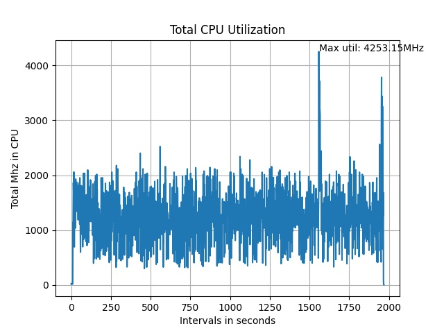

# uav-detection

Drone / Unmanned Aerial Vehicle (UAV) Detection is a very safety critical project. It takes in Infrared (IR) video streams and detects drones in it with high accuracy.

**Scope:**

Real-time Unmanned Aerial Vehicle (UAV) detection system. The objective of the project is to make a real-time embedded drone detection system for a flying vehicle from the infrared data. The model should detect UAV in presence of varying UAV sizes/types, altitudes, distances and lighting conditions.

**Work Done:**

* ***Benchmark of YOLOV5s on Nvidia Jetson TX2 for hardware requirement understanding.***

1. The purpose of this activity was to test how much FPS we can achieve with Jetson TX2 an embedded device by running a YOLOv5s model to see how much more or less resources we need in our embedded device.
2. We could achieve at max **37 FPS with Jetson TX2** with using 100% GPU, 20-30% RAM and 70-90% CPU
3. We used TensorRT inference optimization to optimize the YOLOV5s 640 * 640 PyTorch model with a single class (UAV) and ran inference on a saved video
4. Following the inferences that came out of it:
   1. The main bottleneck was GPU and hence we needed a better GPU or a way to optimize the use of CPU+GPU.
   2. The machine was getting too hot (>90 deg C) within 45 minutes of continuous operation so an industry grade or military grade hardware was required.
   3. The best embedded hardware according to the benchmark is Nvidia Jetson Xavier AGX: [[Link]](https://developer.nvidia.com/embedded/jetson-agx-xavier-i "https://developer.nvidia.com/embedded/jetson-agx-xavier-i")
5. Following are the benchmarks done on Jetson TX2:

**Work in Progress:**

* ***UAV Detection Model training:***

1. We trained a YOLOv5s model to achieve 99.91% mAP with 0.5 IoU threshold.
2. The dataset used was an online dataset we found. Following are its details:

   1. The dataset is a part of [Anti-UAV challenge hosted by ICCV](https://anti-uav.github.io/ "https://anti-uav.github.io/") a very reputed Computer Vision journal. They have open-sourced the data
   2. This data also contains different lighting conditions, backgrounds, drones and distances..
   3. Following is the link to data: [[Link]](https://anti-uav.github.io/dataset/ "https://anti-uav.github.io/dataset/")
3. We also tested the model after fine-tuning on our dataset to evaluate its generalizability and the results were very good. Following is the link to a demo video of inference with latest model: [[Link]](https://drive.google.com/file/d/1wt0rwIqSNb_ueS5vsXDA-Y-XwkqsIWCU/view "https://drive.google.com/file/d/1wt0rwIqSNb_ueS5vsXDA-Y-XwkqsIWCU/view")
4. Use some novel data augmentation techniques specially for small object detection increases accuracy:

   1. Tiling: [[Link]](https://openaccess.thecvf.com/content_CVPRW_2019/papers/UAVision/Unel_The_Power_of_Tiling_for_Small_Object_Detection_CVPRW_2019_paper.pdf "https://openaccess.thecvf.com/content_CVPRW_2019/papers/UAVision/Unel_The_Power_of_Tiling_for_Small_Object_Detection_CVPRW_2019_paper.pdf")
   2. Use of GANs: [[Link]](https://openaccess.thecvf.com/content_ICCV_2019/papers/Liu_Generative_Modeling_for_Small-Data_Object_Detection_ICCV_2019_paper.pdf "https://openaccess.thecvf.com/content_ICCV_2019/papers/Liu_Generative_Modeling_for_Small-Data_Object_Detection_ICCV_2019_paper.pdf")
5. Following are the evaluation metrics of the object detection:

| train/box_loss | train/obj_loss | train/cls_loss | metrics/precision | metrics/recall | metrics/mAP_0.5 | metrics/mAP_0.5:0.95 | val/box_loss | val/obj_loss | val/cls_loss | x/lr0     | x/lr1     | x/lr2     |
| -------------- | -------------- | -------------- | ----------------- | -------------- | --------------- | -------------------- | ------------ | ------------ | ------------ | --------- | --------- | --------- |
| 0.027355       | 0.0039657      | 0              | 0.989             | 0.98299        | 0.98849         | 0.66212              | 0.021445     | 0.0023965    | 0            | 0.0091406 | 0.0091406 | 0.0091406 |

* ***Drone vs Bird Classification:***

1. A classification model based on trajectory of the drone.
2. Current model predicts both drones and birds with high accuracy as drone so if a trajectory based classification is done it makes drone detection more robust.
3. After brainstorming we came up with the following features:
   1. X-coordinate in terms of pixel
   2. Y--coordinate in terms of pixel
   3. z-coordinate in relation to absolute size of frame with UAV Bounding box size
   4. Curvature of drone at particular frame
   5. Eucledian distance from last frame
4. We trained on ensemble of methods and are yet to find the best model
5. PS: The dataset doesn't include a bird class as it doesn't contain one. We tested this on a custom dataaset. If birds are labelled as seperate class that might also make the model more robust. However, since the size of objects can become extremely small it is better to go with this classification approach.

* ***Model Optimization:***

1. This is one of the most critical part of the project because a full-blown deep learning model cannot run on an embedded device @50 FPS.
2. So model quantization as well as sparsification needs to be done in order to to utilize maximum hardware resources to get the best results.
3. We have tried several optimization techniques as follows:
   1. [Deepsparse by Neuralmagic](https://neuralmagic.com/ "https://neuralmagic.com/"): This is probably one of the best methods that could be employed to our need but it was facing issues in setting up on Jetson TX2
   2. [AIMET by Qualcomm](https://quic.github.io/aimet-pages/index.html "https://quic.github.io/aimet-pages/index.html"): This is another toolkit which is very promising but didn’t got much chance to explore it due to time crunch
   3. [TAO by Nvidia:](https://developer.nvidia.com/tao "https://developer.nvidia.com/tao"): This is a toolkit which can be very fruitful but again didn’t explore it much due to time crunch.
   4. [TensorRT:](https://developer.nvidia.com/tensorrt%22%20/l%20%22:~:text=NVIDIA%20%C2%AE%20TensorRT%E2%84%A2%20is,for%20deep%20learning%20inference%20applications. "https://developer.nvidia.com/tensorrt&quot; \l &quot;:~:text=NVIDIA%20%C2%AE%20TensorRT%E2%84%A2%20is,for%20deep%20learning%20inference%20applications.") This is the tool we worked with and its complete setup is already in Nvidia Jetson TX2.
